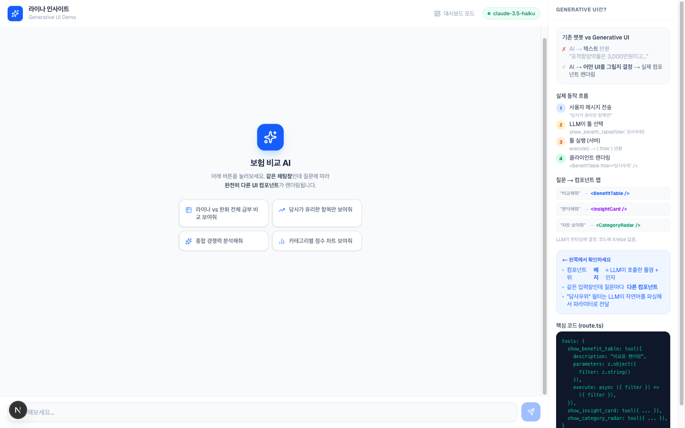
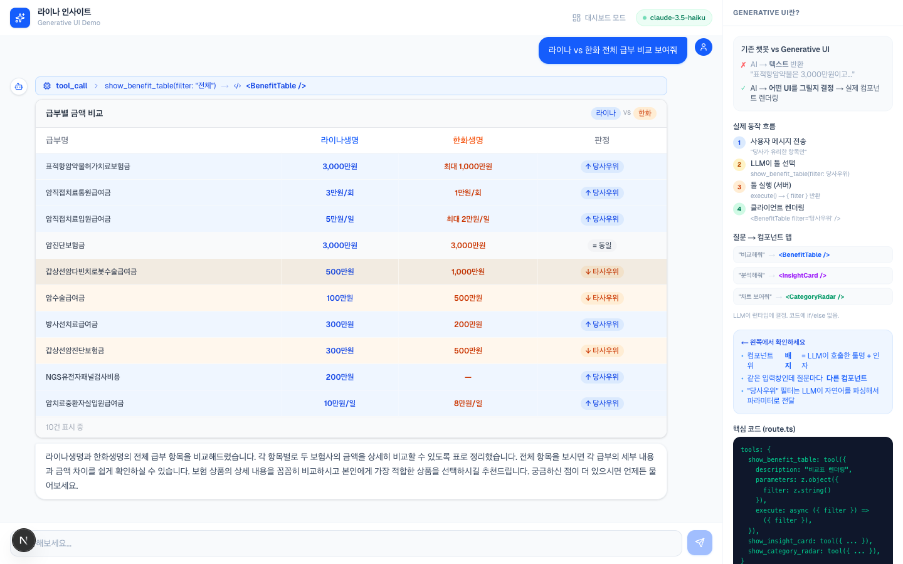
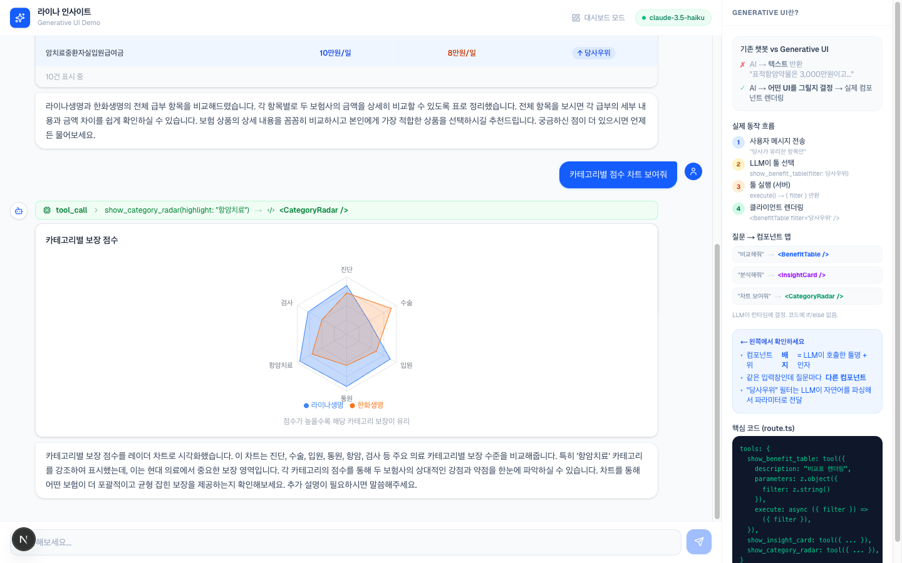
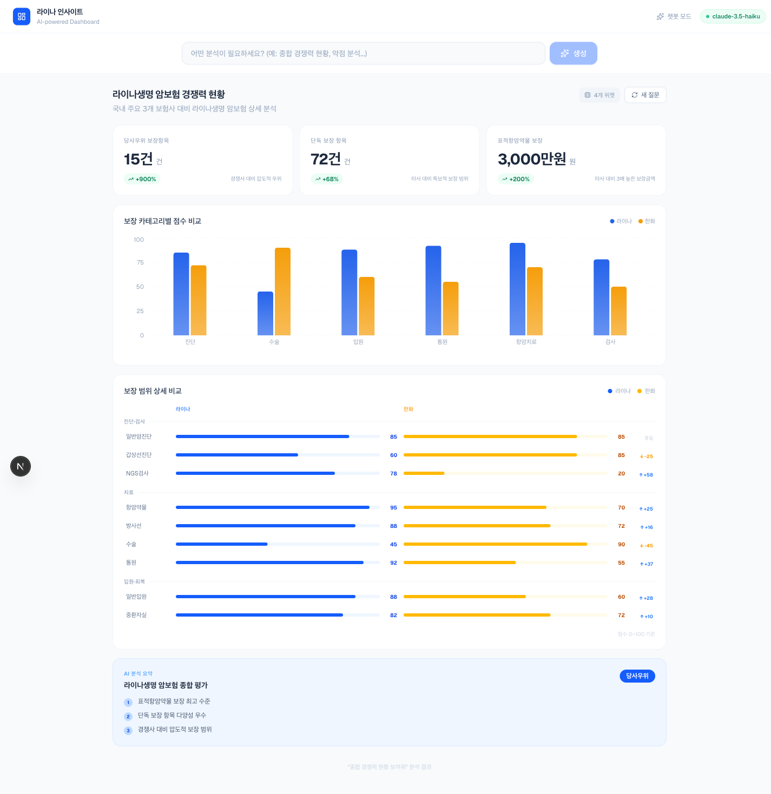

# insurance-compare-gen-ui

> **[insurance-compare](https://github.com/mink555/insurance-compare)** 프로젝트의 Generative UI 데모.  
> 기존 프로젝트가 PDF 파싱 → 데이터 구조화 → 분석 리포트를 생성했다면,  
> 이 데모는 같은 분석 결과를 **AI가 런타임에 UI를 결정해서 보여주면 어떨까?** 를 탐색한 것.


---

## 스크린샷

### 챗봇 모드 — 초기 화면


### 챗봇 모드 — 급부 비교표 렌더링
> "라이나 vs 한화 전체 급부 비교 보여줘" → LLM이 `show_benefit_table(filter: "전체")` 호출 → `<BenefitTable />` 렌더링



### 챗봇 모드 — 레이더 차트 렌더링
> "카테고리별 점수 차트 보여줘" → LLM이 `show_category_radar()` 호출 → `<CategoryRadar />` 렌더링



### 대시보드 모드 — AI가 설계한 레이아웃
> "종합 경쟁력 현황 보여줘" → LLM이 KPI 카드 3개 + 레이더 차트 + 히트맵 + 인사이트 카드 레이아웃 설계



---

## 배경

`insurance-compare`는 라이나생명 vs 한화생명 암보험 특약을 비교하는 프로젝트.  
PDF 상품요약서를 파싱해 구조화된 데이터로 만들고, 인사이트 리포트를 생성함.

이 데모는 그 분석 결과 데이터를 가져와서 다른 질문을 던져본 것:

> **"분석 결과를 보여줄 때, UI 구성도 AI가 결정하게 하면 어떨까?"**

---

## Generative UI란?

기존 방식은 분석 결과를 **정해진 UI**에 채워넣음.  
Generative UI는 LLM이 질문을 분석해서 **어떤 UI를 그릴지** 런타임에 결정함.

```
기존: 사용자 질문 → LLM → 텍스트 응답
                              "표적항암약물은 3,000만원이고 한화는 1,000만원입니다..."

Gen UI: 사용자 질문 → LLM → 툴 호출 결정 → 컴포넌트 렌더링
                              show_benefit_table(filter: "당사우위")
                                      ↓
                              <BenefitTable filter="당사우위" />
```

같은 데이터, 같은 화면인데 **질문에 따라 완전히 다른 UI**가 나옴.

---

## 두 가지 패턴 구현

### 1. 챗봇 모드 (`/`) — Tool Calling

질문하면 LLM이 3개의 툴 중 어떤 컴포넌트를 렌더링할지 선택함.

| 질문 | LLM 결정 | 렌더링 |
|---|---|---|
| "전체 급부 비교해줘" | `show_benefit_table(filter: "전체")` | 전체 비교표 |
| "당사가 유리한 항목만" | `show_benefit_table(filter: "당사우위")` | 필터된 비교표 |
| "종합 경쟁력 분석해줘" | `show_insight_card()` | 인사이트 요약 카드 |
| "카테고리별 차트" | `show_category_radar()` | 레이더 차트 |

### 2. 대시보드 모드 (`/dashboard`) — Layout Generation

질문하면 LLM이 **대시보드 레이아웃 전체**를 JSON으로 설계함.  
위젯 종류, 개수, 배치 순서를 모두 LLM이 결정함.

| 질문 | LLM이 설계한 레이아웃 |
|---|---|
| "종합 경쟁력 현황" | KPI 카드 3개 + 카테고리 바 차트 + AI 인사이트 |
| "우리 약점이 뭐야?" | KPI 카드 + 격차 분석 차트 + 보장 히트맵 + 타사우위 인사이트 |
| "라이나 vs 한화 비교" | 비교 바 차트 + 보장 범위 히트맵 |
| "항암 보장 트렌드" | 트렌드 에리어 차트 + KPI 카드 |

---

## 기술 스택

| 역할 | 라이브러리 |
|---|---|
| 프레임워크 | Next.js 15 (App Router) |
| AI SDK | Vercel AI SDK v6 (`ai`, `@ai-sdk/react`) |
| LLM | `anthropic/claude-3.5-haiku` via OpenRouter |
| 시각화 | Recharts (Bar, Area, Radar) |
| 스타일링 | Tailwind CSS v3 |
| 스키마 | Zod v3 |

---

## 프로젝트 구조

```
src/
├── app/
│   ├── page.tsx                  # 챗봇 모드
│   ├── dashboard/page.tsx        # 대시보드 모드
│   └── api/
│       ├── chat/route.ts         # streamText + tool calling
│       └── dashboard/route.ts    # JSON 레이아웃 생성
├── components/
│   ├── insurance/                # 챗봇 컴포넌트 (비교표, 인사이트, 레이더)
│   └── dashboard/                # 대시보드 위젯 (KPI, 차트, 히트맵)
└── lib/
    └── insurance-data.ts         # insurance-compare 분석 결과 목 데이터
```

---

## 로컬 실행

```bash
git clone https://github.com/mink555/insurance-compare-gen-ui
cd insurance-compare-gen-ui
npm install

cp .env.example .env.local
# .env.local 에 OPENROUTER_API_KEY 입력

npm run dev
```

`http://localhost:3000` 접속

---

## 환경변수

```env
OPENROUTER_API_KEY=sk-or-v1-...
```

[openrouter.ai/keys](https://openrouter.ai/keys)에서 발급. `anthropic/claude-3.5-haiku` 사용.

---

## Vercel 배포

```bash
npm i -g vercel
vercel
vercel env add OPENROUTER_API_KEY
vercel --prod
```

---

## 관련 프로젝트

- **[insurance-compare](https://github.com/mink555/insurance-compare)** — 이 데모의 원본 프로젝트. PDF 파싱 → 특약 구조화 → 분석 리포트
